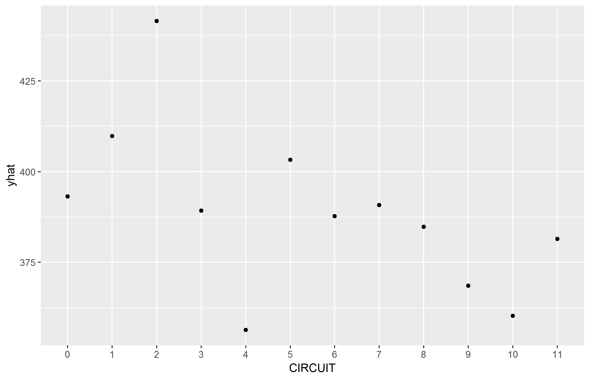

<style>
body {
text-align: justify}
</style>


```{r setup, include=FALSE}
knitr::opts_chunk$set(echo = TRUE)
```


```{r ICE, out.width = "50%",  fig.show='hold'} 
# data <- readRDS("data.rds")
# 
# samp_size <- floor(0.75*nrow(data))
# set.seed(1000)
# 
# train_ind <- sample(seq_len(nrow(data)), size = samp_size)
# train <- data[train_ind,]
# test <- data[-train_ind,]
# 
# features <- as.data.frame(data[, !(colnames(data) %in% c("OPEN_DAYS"))])
# response <- as.data.frame(as.numeric(as.vector(data$OPEN_DAYS)))
# 
# predictor.rf <- Predictor$new(model = pruned_tree,   data = features,   y = response)#, predict.fun = predfunc)
# 
# 
# p1 <- partial(pruned_tree, pred.var = "ORIGIN_CAT", plot = TRUE, rug = TRUE, plot.engine = "ggplot2")
# p2 <- partial(pruned_tree, pred.var = "CIRCUIT", plot = TRUE, rug = TRUE, plot.engine = "ggplot2")
# p3 <- partial(pruned_tree, pred.var = "DISTRICT_CAT", plot = TRUE, rug = TRUE, plot.engine = "ggplot2")
# p4 <- partial(pruned_tree, pred.var = "JURY_DEMAND", plot = TRUE, rug = TRUE, plot.engine = "ggplot2")
# p5 <- partial(pruned_tree, pred.var = "FEE_STATUS", plot = TRUE, rug = TRUE, plot.engine = "ggplot2")
# p6 <- partial(pruned_tree, pred.var = "PRO_SE_CAT", plot = TRUE, rug = TRUE, plot.engine = "ggplot2")
# p7 <- partial(pruned_tree, pred.var = "TRANSFER_DATE_CAT", plot = TRUE, rug = TRUE, plot.engine = "ggplot2")
# p8 <- partial(pruned_tree, pred.var = "MONETARY_AMOUNT_DEMANDED_CAT", plot = TRUE, rug = TRUE, plot.engine = "ggplot2")
# p9 <- partial(pruned_tree, pred.var = "COUNTY_OF_RESIDENCE_CAT", plot = TRUE, rug = TRUE, plot.engine = "ggplot2")
# 
# 
# ggsave(file="pdp_pruned_tree_1.png", p1)
# ggsave(file="pdp_pruned_tree_2.png", p2)
# ggsave(file="pdp_pruned_tree_3.png", p3)
# ggsave(file="pdp_pruned_tree_4.png", p4)
# ggsave(file="pdp_pruned_tree_5.png", p5)
# ggsave(file="pdp_pruned_tree_6.png", p6)
# ggsave(file="pdp_pruned_tree_7.png", p7)
# ggsave(file="pdp_pruned_tree_8.png", p8)
# ggsave(file="pdp_pruned_tree_9.png", p9)
# 
# 
# features <- as.data.frame(data[, !(colnames(data) %in% c("OPEN_DAYS"))])
# response <- as.data.frame(as.numeric(as.vector(data$OPEN_DAYS)))
# 
# predictor.rf <- Predictor$new(model = pruned_tree,   data = features,   y = response)#, predict.fun = predfunc)
# 
# 
# rf.org <- Partial$new(predictor.rf, "ORIGIN_CAT") %>% plot() + ggtitle("Pruned Tree")
# temp <- data.frame(rf.org$data$ORIGIN_CAT, rf.org$data$.y.hat)
# g <- ggplot(temp, aes(y=rf.org.data..y.hat, x = rf.org.data.ORIGIN_CAT)) +
#   geom_boxplot()  + labs(x = "ORIGIN_CAT", y = 'Open_Days', title="Pruned Tree")  +
#   theme(plot.title = element_text(hjust = 0.5))
# ggsave(file="ice_pruned_tree_boxplot_ORIGIN_CAT.png", g)
# 
# 
# rf.org <- Partial$new(predictor.rf, "COUNTY_OF_RESIDENCE_CAT") %>% plot() + ggtitle("Pruned Tree")
# temp <- data.frame(rf.org$data$COUNTY_OF_RESIDENCE_CAT, rf.org$data$.y.hat)
# g <- ggplot(temp, aes(y=rf.org.data..y.hat, x = rf.org.data.COUNTY_OF_RESIDENCE_CAT)) +
#   geom_boxplot()  + labs(x = "COUNTY_OF_RESIDENCE_CAT", y = 'Open_Days', title="Pruned Tree")  +
#   theme(plot.title = element_text(hjust = 0.5))
# ggsave(file="ice_pruned_tree_boxplot_COUNTY_OF_RESIDENCE_CAT.png", g)
# 
# 
# rf.org <- Partial$new(predictor.rf, "MONETARY_AMOUNT_DEMANDED_CAT") %>% plot() + ggtitle("Pruned Tree")
# temp <- data.frame(rf.org$data$MONETARY_AMOUNT_DEMANDED_CAT, rf.org$data$.y.hat)
# g <- ggplot(temp, aes(y=rf.org.data..y.hat, x = rf.org.data.MONETARY_AMOUNT_DEMANDED_CAT)) +
#   geom_boxplot()  + labs(x = "MONETARY_AMOUNT_DEMANDED_CAT", y = 'Open_Days', title="Pruned Tree")  +
#   theme(plot.title = element_text(hjust = 0.5))
# ggsave(file="ice_pruned_tree_boxplot_MONETARY_AMOUNT_DEMANDED_CAT.png", g)
# 
# rf.org <- Partial$new(predictor.rf, "TRANSFER_DATE_CAT") %>% plot() + ggtitle("Pruned Tree")
# temp <- data.frame(rf.org$data$TRANSFER_DATE_CAT, rf.org$data$.y.hat)
# g <- ggplot(temp, aes(y=rf.org.data..y.hat, x = rf.org.data.TRANSFER_DATE_CAT)) +
#   geom_boxplot()  + labs(x = "TRANSFER_DATE_CAT", y = 'Open_Days', title="Pruned Tree")  +
#   theme(plot.title = element_text(hjust = 0.5))
# ggsave(file="ice_pruned_tree_boxplot_TRANSFER_DATE_CAT.png", g)
# 
# 
# rf.org <- Partial$new(predictor.rf, "PRO_SE_CAT") %>% plot() + ggtitle("Pruned Tree")
# temp <- data.frame(rf.org$data$PRO_SE_CAT, rf.org$data$.y.hat)
# g <- ggplot(temp, aes(y=rf.org.data..y.hat, x = rf.org.data.PRO_SE_CAT)) +
#   geom_boxplot()  + labs(x = "PRO_SE_CAT", y = 'Open_Days', title="Pruned Tree")  +
#   theme(plot.title = element_text(hjust = 0.5))
# ggsave(file="ice_pruned_tree_boxplot_PRO_SE_CAT.png", g)
# 
# 
# rf.org <- Partial$new(predictor.rf, "FEE_STATUS") %>% plot() + ggtitle("Pruned Tree")
# temp <- data.frame(rf.org$data$FEE_STATUS, rf.org$data$.y.hat)
# g <- ggplot(temp, aes(y=rf.org.data..y.hat, x = rf.org.data.FEE_STATUS)) +
#   geom_boxplot()  + labs(x = "FEE_STATUS", y = 'Open_Days', title="Pruned Tree")  +
#   theme(plot.title = element_text(hjust = 0.5))
# ggsave(file="ice_pruned_tree_boxplot_FEE_STATUS.png", g)
# 
# 
# rf.org <- Partial$new(predictor.rf, "ORIGIN_CAT") %>% plot() + ggtitle("Pruned Tree")
# temp <- data.frame(rf.org$data$ORIGIN_CAT, rf.org$data$.y.hat)
# g <- ggplot(temp, aes(y=rf.org.data..y.hat, x = rf.org.data.ORIGIN_CAT)) +
#   geom_boxplot()  + labs(x = "ORIGIN_CAT", y = 'Open_Days', title="Pruned Tree")  +
#   theme(plot.title = element_text(hjust = 0.5))
# ggsave(file="ice_pruned_tree_boxplot_ORIGIN_CAT.png", g)
# 
# 
# rf.org <- Partial$new(predictor.rf, "JURY_DEMAND") %>% plot() + ggtitle("Pruned Tree")
# temp <- data.frame(rf.org$data$JURY_DEMAND, rf.org$data$.y.hat)
# g <- ggplot(temp, aes(y=rf.org.data..y.hat, x = rf.org.data.JURY_DEMAND)) +
#   geom_boxplot()  + labs(x = "JURY_DEMAND", y = 'Open_Days', title="Pruned Tree")  +
#   theme(plot.title = element_text(hjust = 0.5))
# ggsave(file="ice_pruned_tree_boxplot_JURY_DEMAND.png", g)
# 
# 
# rf.org <- Partial$new(predictor.rf, "DISTRICT_CAT") %>% plot() + ggtitle("Pruned Tree")
# temp <- data.frame(rf.org$data$DISTRICT_CAT, rf.org$data$.y.hat)
# g <- ggplot(temp, aes(y=rf.org.data..y.hat, x = rf.org.data.DISTRICT_CAT)) +
#   geom_boxplot()  + labs(x = "DISTRICT_CAT", y = 'Open_Days', title="Pruned Tree")  +
#   theme(plot.title = element_text(hjust = 0.5))
# ggsave(file="ice_pruned_tree_boxplot_DISTRICT_CAT.png", g)
# 
# 
# rf.org <- Partial$new(predictor.rf, "CIRCUIT") %>% plot() + ggtitle("Pruned Tree")
# temp <- data.frame(rf.org$data$CIRCUIT, rf.org$data$.y.hat)
# g <- ggplot(temp, aes(y=rf.org.data..y.hat, x = rf.org.data.CIRCUIT)) +
#   geom_boxplot()  + labs(x = "CIRCUIT", y = 'Open_Days', title="Pruned Tree")  +
#   theme(plot.title = element_text(hjust = 0.5))
# ggsave(file="ice_pruned_tree_boxplot_CIRCUIT.png", g)





knitr::include_graphics("pdp_pruned_tree_5.png")


```


```{r out.width = "50%",  fig.show='hold'} 


```
